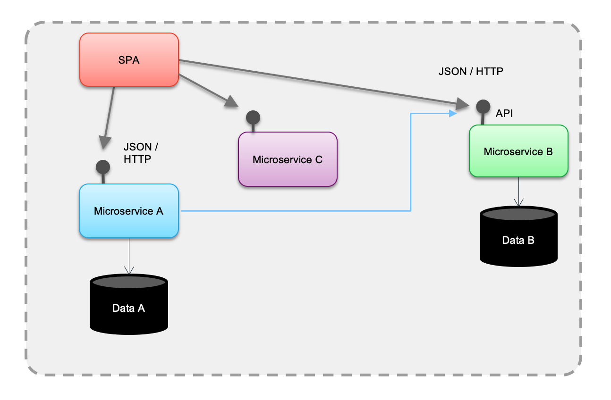
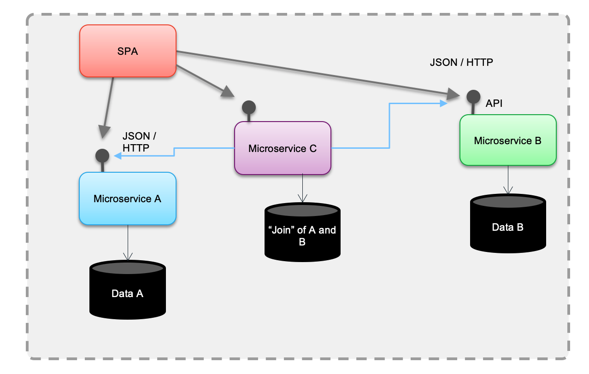

<InlineNotification kind="warning">
<strong>Updated 10/07/2021</strong>
</InlineNotification>

As we have seen in the introduction, modern business application needs to responds to events in real time, 
as the event happen, so it can deliver better user experiences and apply business rule on those events. 
The key is to be able to act quickly on those facts. Acting may involve computing analytics or machine 
trained models. 

On top of that a modern cloud native application needs to be reactive, responsive by adopting the [reactive manifesto](/advantages/reactive). 
We can also claim they are becoming intelligence by integrating rule engine and predictive scoring / AI capabilities. 

When adopting microservice implementation approach, the bounded context is defined with events and aggregates or main business entity. 
So each microservice is responsible to manage the operations of creating, updating and reading the data from a 
main business entity. This clear separation leads to exchange data between services, they may used to be
integrated in the same monolytic application before.

A web application, single page app (SPA), accesses the different microservices using RESTful API, 
to get the different data views it needs, or to post new data elements to one of the service.
The following diagram illustrates a simple view of the microservice challenges:

 

When the user interface exposes entry form to get data for one of the business entity, 
it calls a REST end point with a HTTP POST operation, then data are saved to data store: 
document oriented database or SQL based RDBMS.

When a microservice (1) needs to access data from another service, then it calls 
another end point via an HTTP GET. A coupling is still existing, at the data schema definition level:
a change to the data model, from the source microservice, impacts the service contract and so all the callers. 
This may be acceptable when there is few microservices, but could become a real pain when the number increase.

When the microservice dependencies grows in size and complexity, 
as illustrated by the following figure from [Jack Kleeman's Monzo study](https://monzo.com/blog/we-built-network-isolation-for-1-500-services), 
we can see the coupling impact, which lead to impacting time to deliver new function and 
cost to maintain such complexity.

 

Finally, imagine we need to join data coming from two different services to address an urgent business request? 
Who will implement the join, service A or B? May be the simplest is to add a service C and 
implement the join: it will call two API end points, and try to reconcile data using primary keys 
on both business entities.

 

With event-driven microservices, the communication point becomes the Pub/Sub layer of 
the event backbone. By adopting an event-based approach for intercommunication between 
microservices, the microservices applications are naturally responsive (event-driven). 
This approach enhances the loose coupling nature of microservices because it decouples 
producers and consumers. The figure below illustrates, that microservices A and B produces
 facts about their business entities, and their life cycle to topic in the pub/sub event backbone:

 

The microservice C consumes those facts to build it own projection or view for supporting the join query.

When adopting technology like Kafka as messaging backbone, the data sharing is 
done via an event log, which can be kept for a very long time period, and is replayable 
to improve resilience. These event style characteristics are increasingly important 
considerations when you develop microservices style applications. In practical 
terms microservices applications are a combination of synchronous API-driven, 
and asynchronous event-driven communication styles. 

There is something important to add, is that coupling by the data, still existing but in
a less impactful manner. Messaging structures are defined with JSON schema or Avro schema and
managed inside a Schema registry, so Kafka-based applications can get their data contract.  

The following figure presents a potential structure for event-driven microservice: 
APIs are defined using microprofile OpenAPI annotations in one or more JAXRS resource 
classes. Those APIs can then be managed within an API management product as IBM API 
Connect.

The rest of the application structure reflects the DDD approach of onion architecture. 
The business logic is in its own layer with DDD aggregate, ubiquitous language, services,
business rules, etc…
The repository layer supports persisting those aggregates to an external document-oriented 
or SQL-based database.
As most of the new microservices are message-driven, we are adding a messaging layer 
that may use queues or topics. Use queue for request/response exactly once delivery 
and topic for sharing facts in append log.
In Java, the Microprofile Reactive Messaging is used to define the different publishing 
channels, being queue, topic, or both.
From the JSON or Avro schema defining the messages or events structure, 
developers can build an AsyncAPI specification which may also be managed by an API product.