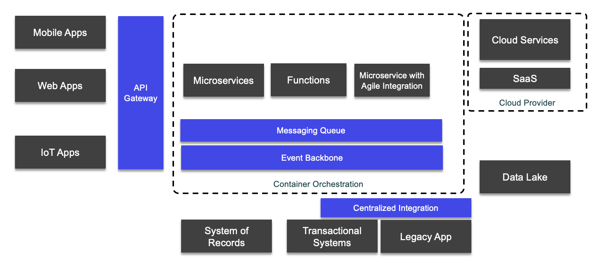
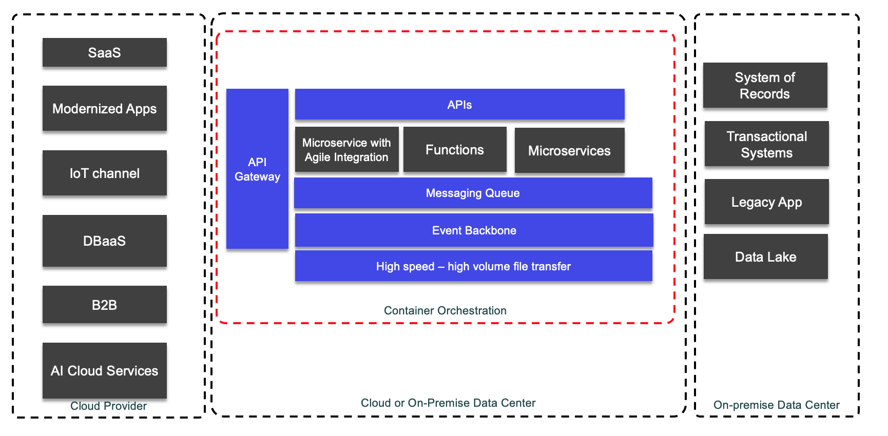

Event driven architecture is a complement of the overall integration reference architecture as [presented in IBM Cloud architecture center](https://www.ibm.com/cloud/architecture/architectures/modern-integration/overview).

In this note we want to summarize some of the important aspects of agile integration and how some of the technologies delivered as part of IBM Cloud Pak for Integration are used when doing application modernization with event-driven microservice. Some of our labs and reference implementation code, use API management, MQ and APP Connect.

First let do a quick review of the major concept for agile integration.

## Agile integration concepts

The main agile integration concepts as presented in detail in the [IBM cloud on agile integration article](https://www.ibm.com/cloud/integration/agile-integration) can be summarized as:

* Empower extended teams to create integrations, leveraging a complete set of integration styles and capabilities to increase overall team productivity.
* Agile integration includes container-based, decentralized, microservices-aligned approach for integrating solutions
* Existing centralized integration architectures, based on ESB pattern, cannot support the demand, in term of team reactivity and scalability at the internet level.
* ESB pattern provides standardized synchronous connectivity to back-end systems typically over web services (SOAP based). ESB formed a single infrastructure for the whole enterprise, with tens or hundreds of integrations installed on a production server cluster.
* A single, centralized ESB certainly simplifies consistency and governance of implementation.
* Interface maintenance is expensive.
* Any deployment to the shared servers runs the risk of destabilizing existing critical interfaces.
* SOA encounters the issue of getting the funding at the enterprise wide program to maintain reusable interface.
* Integration teams are becoming the bottleneck instead of being enabler.
* SOA is about real-time integration between applications, whereas a microservices architecture is about how the applications are built internally.
* Microservice enables greater agility by being:
   * small enough to be understood completely by their owning team and changed independently
   * elastic to scale horizontally
   * resilient with changes to one microservice will not affect others at runtime

The following diagram illustrates the agile integration modernization transition from a centralized ESB type of architecture, and breaking integration into smaller  pieces to make them more agile and more scalable.

In this modernization process, development team can introduce API Management to improve decoupling between consumers and providers ultimately moving to a decentralized approach where each team can manage their own integration.

* Three aspects to agile integration:

    1. **Decentralized integration ownership**: give application teams more control over the creation and exposure of their own integration exposed as APIs, or messages
    1. **Fine-grained integration deployment** to separate integration, scalable independently. Changes to individual integration flows can be automatically rebuilt and deployed independently of other flows to enable safer application of changes and maximize speed to production.
    1. **Cloud-native integration infrastructure** to improve productivity, operational consistency and portability for both applications and integration

## Cloud Pak for Integration capabilities relevant to this site

### API management

* Easier to discover new business assets (APIs and events) in current enterprise systems
* Existing enterprise assets are made available to new channels and new audiences, with enriched customer experience in integrated omnichannel interactions
* Support asynchAPI.

### App connect

Connect applications and data sources on premises or in the cloud to coordinate the exchange of business information so that data is available when and where it’s needed.

[App Connect](https://www.ibm.com/docs/en/app-connect/11.0.0?topic=app-connect-enterprise-software) capabilities:

* Low-code/no-code integration tooling leverages natural language processing (NLP) and AI to offer custom mapping suggestions when building integration flows.
* Pre-built smart connectors and a common, shareable asset repository increases speed of delivery and eliminates concerns about mismatched sources, formats, or standards

#### Labs

* [Secure API, App connect and MQ](https://www.ibm.com/cloud/garage/dte/tutorial/unlock-your-enterprise-data-using-secure-apis-app-integration-flows-and-reliable-messaging): older version of the UI in screen shots but still relevant use case.

### Messaging

Messaging is to support asynchronous communication between applications. Two technologies are part of the reference architecture, queuing and pub/sub.

#### IBM MQ

See a technology summary in [this note](/technology/mq/) and this [MQ to Kafka lab](/use-cases/connect-mq/). 

#### Kafka based product 

This site includes a lot of content around Kafka [(see this technology summary)](/technology/kafka-overview/), but the major capabilities of interest in term of agile integration is the pub/sub model, long term persistence via append log and replication to support high availability and resiliency, with data streaming logic, and a lot of connectors to source data or sink data to external systems. 

Kafka scale and is a reliable messaging system for modern event-driven microservice solution.

## Bridge your digital ecosystem and core enterprise

At a high level, modern integration involves bridging the capabilities between your digital ecosystem and your traditional core enterprise. The bridging takes place in a seamless, frictionless way so that you can uniformly operate your entire business anytime, anywhere, regardless of technological fluctuations.

In your digital transformation journey, your digital ecosystem and your core enterprise constantly change. You need a set of integration capabilities to support rapid change to interface, develop new business oriented integration flow to consume cloud services and software as a service, get visibility to the data in motion, integrate with existing transactional systems and system of record. 

You modern cloud native applications use microservice design, function as a service, and may use agile, no code, integration logic to integrate with existing systems, SOA services, or cloud based services. Modern applications are reusing public cloud services, like CRM application, Database as a service, Chat bot as a services... Those services can be offered by different cloud providers, and architects will select the best services according to their requirements and cost / benefits analysis. A unique cloud provider will not have all the best useful services, and hybrid cloud is a standard approach in the 2020s. What is important is to get a set of tool that makes the integration easy to do with simple configuration to integrate with the needed data and inject those data in the operational messaging system for other to consumer. This agile integration follows the same DevOps pattern as other microservices. 

The messaging layer can support point to point, request/reply type of communication, or a pub/sub model with long retention time, and data streams processing. This data injection layer can be a [buffer to modern data lake](/introduction/reference-architecture/#modern-data-lake).

Finally existing applications, system of records, transactional systems have to be integrated, consumed and accessed from modern applications, with new digital channel like mobile and single page web application.  

API management is an important elements of the integration, to manage and provide API economy but also secure access to internal systems, with controlled traffic. This is the role of the API gateway.

## Optimize your integration platform

A vendor neutral hybrid cloud, that uses open standards and container orchestration technology, presents the optimal platform for modern integration. It addresses multicloud operations, different deployment options, and integration patterns within a modular and scalable environment.

As shown in the diagram below, the integration platform must accommodate many integration patterns and have that support ready on demand and as a self-service model.

* API integration enables synchronous access to fine-grained services, such as create, retrieve, update, and delete operations to business objects across various backends. Thus, the composition of the integration logic on the consumer side. Modern API management also includes the management of AsynchAPI for messaging systems and asynchronous communication between event-driven microservices.

* Application data integration enables synchronous access to coarse-grained services such as transaction processing across various backends in accordance with enterprise compliance requirements. Thus, the governance of integration logic on the provider side.

* Enterprise messaging enables asynchronous point-to-point access to services such as those that involve closed heritage systems, transactional integrity systems or heterogeneous partner backends.

* Event publish/subscribe integration enables asynchronous many-to-many coordination of services across both cloud and on-premises components in an event-driven architecture context.

* File transfer enables batch integration between SORs that involves the movement of large data files for content across vast physical distances within short time windows.

The integration platform must provide a unified framework for security, management operations, and resiliency. The container orchestration platform provides resiliency through the elasticity of container clusters and platform-level security. The unified management component provides ease of operations with a single view across all integration components within the platform. The gateway services provide runtime-level security and enforce access control policies to integration services.

## API lifecycle management architecture

The API lifecycle management reference architecture bridges the gap between cloud and on-premises applications quickly and easily. It allows customers to securely unlock IT assets and to deliver innovative applications with modern architectures.

An international bank develops a new business model in a new ecosystem. This model exposes their rewards enterprise application program with a retail partner's online and mobile applications via self-service access to the program APIs. The bank's objective is to leverage the hybrid cloud capability to manage a comprehensive end-to-end integrated experience across the API lifecycle: create, run, manage, secure, socialize, and analyze APIs.

1. An API developer signs on to the API management cloud services account and accesses the API developer User interface or CLI toolkit. The developer creates the synch API and implements business logic. He maps and integrates the API data model to the back-end schema through the transformation and connectivity service. He tests and deploys the API to the runtime and publishes to API management. He can also create Asynch APIs from a messaging system by binding channels to topic or queue and define message payload definition.
1. API owner signs on to the API management cloud services account and accesses the API management component. She includes the synch API endpoint to existing API products, and plans and specifies access control. She publishes the API to the developer portal for external discovery by application developers.
1. An application developer accesses the developer portal, uses search, and discovers the API.
1. The application developer uses the API in an application and deploys that application to the device.
1. The device user opens the application that issues the API request. The request is handled by the API gateway, which performs load balancing and security validation for all API requests. The API gateway validates access policies with API management and invokes the API. The API polyglot runtime executes the API and obtains the data payload from the back end. The API response is sent back to the API gateway. Alternatively, APIs exposed by enterprise applications can be executed on that enterprise application runtime. The API gateway forwards the response to the calling application. The API gateway reports usage metrics and analytics to the API management.
1. API developers and API owners can log on to the API analytics visualization component to view dashboards on API usage metrics and other analytics.