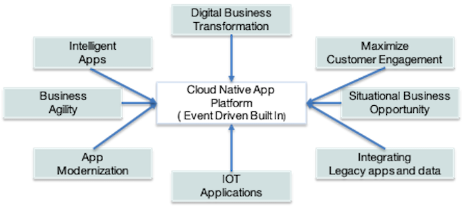

## Introduction to the IBM Automation Event-Driven Reference Architecture

The modern digital business works in near real-time; it informs interested parties of things of interest when they happen, makes sense of, and derives insight from an ever-growing number of sources. It learns, predicts, and is intelligent -- it is by nature Event-Driven.

Event-driven architecture (EDA) is an architecture pattern that promotes the production, detection, consumption of, and reaction to events. This architectural pattern can be applied to the systems that transmit events among loosely coupled software components and services.

Events are a way of capturing a statement of fact.  Events occur in a continuous stream as things happen in the real and digital worlds.  By taking advantage of this continuous stream, applications can not only react in near real-time, but also reason about the future based upon what has happened in the past.

The business value of adopting this architecture is that you can easily extend EDA with new components that are ready to produce or consume events that are already present in the overall system. While events are more visible, new business capabilities are addressed, like near real-time insights. EDA helps also to improve the continuous availability of a microservice architecture.

For enterprise IT teams, embracing event-driven development is foundational to the next generation of digital business applications. IT teams will need to be able to design, develop, deploy and operate event-driven solutions, in cloud-native styles.

While event-driven architectures and reactive programming models are not new concepts, the move to cloud-native architectures with microservices, container based workloads and "server-less" computing allow us to revisit event-driven approaches in this cloud-native context.  Indeed, we could think of event-driven as extending the resilience, agility and scale characteristics of "cloud-native" to also be reactive and responsive. Two aspects of a cloud-native architecture are essential to developing an event-driven architecture:

* [Microservices](advantages/microservice) - These provide the loosely coupled application architecture which enables deployment in highly distributed patterns for eesilience, agility and scale.
* Cloud-native platforms with Containers and "Serverless deployments" - These provide the application platform and tools which realize the resilience, agility and scale promise of the microservices architectures.

An event-driven architecture should provide the following essential event capabilities to the cloud-native platform.

* Being able to communicate and persist events.
* Being able to take direct action on events.
* Processing event streams to derive near real-time insight/intelligence.
* Providing communication for event driven microservices.
