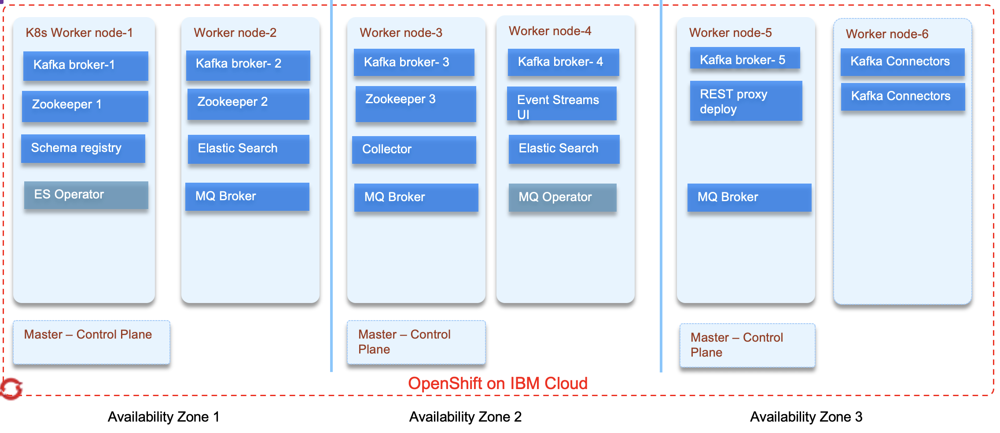
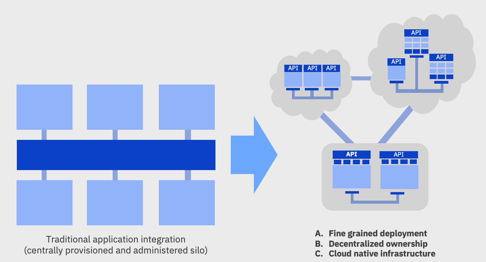
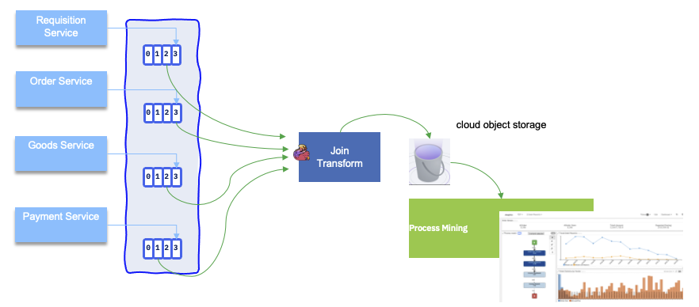
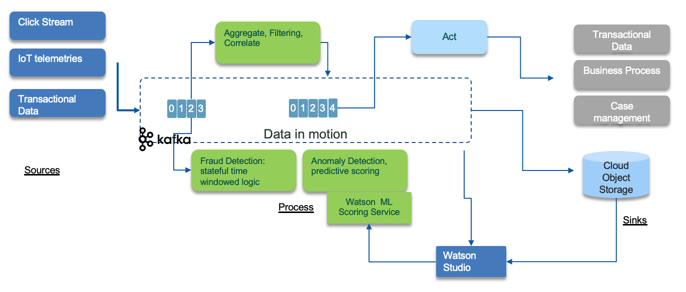
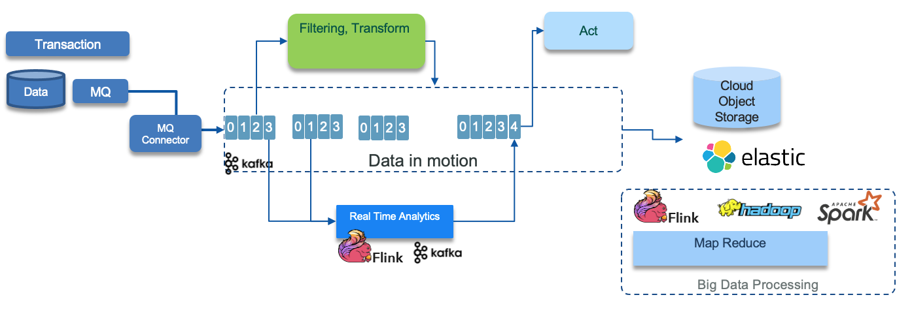

Updated 05/27/2022

We defined the starting point for a cloud-native event-driven architecture to be that it supports at least the following important capabilities:

* Being able to communicate asynchronously between components to improve elasticity, resilience and responsiveness. 
* Support exactly one delivery of messages in a asynchronous request/response interactions
* Publish messages as facts or events as immutable records to an append log so subscribers can consume them at any point of time.
* Processing streams of events to derive real time insight/intelligence.
* Providing communication mechanism between event-driven microservices and functions.

## From SOA to EDA and meet in the middle

We do not need to present Service Oriented Architecture as a way to organize modern application... Well modern was started in 2003. 
In 2006, Enterprise Service Bus was at the center of thee SOA adoption with API exposure, mediation flows, and service gateway.
ESB is a pattern but also a product.

 

Business services exposes APIs, defined with WSDL and the protocol is XML heavy with SOAP. The rich set of specification in the [ws-*](https://en.wikipedia.org/wiki/List_of_web_service_specifications) 
helps to address complex business applications, where application can dynamically searching for API producer, bind to the end point, and then call the service.

SOA is still a core structure of IT architecture today.

Two major characteristics of IT architecture are the scalability and the coupling with others.
With the way most of SOA services are done is by pulling data from other services or call operation on API
to make something done (delegation, command patterns). The dependencies between service via the
service contract, and the heavy use of XML have put some limit to the scalability and coupling dimensions.

EDA was already proposed, in 2004, as a way to address scalability, as illustrated by this figure below:

EDA helps to decouple communication and contract between services, move to push data as immutable facts amd async communication.

New applications started to be implemented, early 2010s, to address scalability need. RESTful and JSON are
becoming ubiquituous technology, protocols to use. This is a neat evolution from SOAP and XML, but the applications
exposing API with OpenAPI specification are still point to point, and the data pull is still the 
pattern to get access to data. The [reactive manifesto](/advantages/reactive/#overview) is also 
promoting sound principles to make modern applications more responsive, resilient and elastics therefore adopting messages. 

EDA and SOA do not have to compete, but are complementary addressing different kind of problem. 
Combined together they provide innovative business solutions to problems we never thought could be solved:

* Event driven business process
* near real-time analytics
* real-time flow analysis
* complex event processing with time window based business rules
* services act as event source or sink
* event trigger services
* service to process events

## Event Driven Architecture

Event-driven architecture is not something new, and it is not just about Kafka. As listed in previous section EDA at the core has to support 
asynchronous communication between application in two major semantics:

* request/response with exactly one delivery with no data lost, when a component is asking another component to do something for it. This approach
is to address long running transaction or business process and enforce using queuing technology.
* deliver facts about its own data to an immutable log so other components can derive something about it. This is a pub/sub model with strong time decoupling.

To support these EDA has a message as a service capability as cluster of message brokers. The brokers
provides the connectivity between the other components: 

Where:

* [Event sources](../../concepts/terms-and-definitions/#event-sources): generates events from sources such as IoT devices, web apps, mobile apps, mainframe applications, change data capture agents...
* **Mainframe queuing apps** are source for messages using the IBM MQ replication feature to expose mainframe messages to the cloud native MQ broker and so to the cloud native microservices. The strong consistency
is kept but facts about the business transactions are propagated to the eventual consistency world.
* **Messaging as a service** is the core backbone of the architecture to support  any type of asynchronous communication:

    * [IBM MQ](https://www.ibm.com/cloud/mq): delivers the exatly one delivery, strong consistency and supports queuing and pub/sub protocol. MQ brokers in cluster support high availability cross data centers to build event-mesh. IBM MQ will be the unique technology to guarantee the end to end message availability.
    * [IBM Event Streams](https://www.ibm.com/cloud/event-streams): provides an event backbone supporting Pub/Sub protocol only, with immutable append log. Event Streams is based on [Apache Kafka](https://kafka.apache.org/) and can run on-premise or as [managed services](https://cloud.ibm.com/catalog/services/event-streams)

* **Reactive cloud native applications**: The top row represents modern applications which adopt the [reactive manifesto](https://www.reactivemanifesto.org/) as a way to be resilient, elastic and message driven. To reduce microservice to microservice dependency and reduce coupling, modern microservices are 
[event-driven](../../concepts/terms-and-definitions/#microservices) and 
implemented with reactive framework (e.g. vert.x )and reactive messaging (e.g. microprofile 3.0 reactive messaging). Some of those applications can be function and serverless apps, meaning scaling to zero and being
able to wake-up on event arrival. Finally it is important to note that business process applications running in BPM can be triggered
by event arrival, can generate intermediate events, and can generate events at the process completion. Those business events are important to shared
with other applications to being expose to event backbone.
* The adoption of Kafka as a way to support event backbone capability, also means that records can be saved for a long period of time, but it is relevant to be able to persist those records
or an aggregate view of those records to a data lake or a set of s3 buckets. So most of EDA has sink connectors to data lake. 
* The governance of these asynchronous applications is becoming a major requirement when the adoption of such architecture grows. AsyncAPI, combined with schema registry
helps defining the intercommunication contracts. While most of the event-driven microservices are exposing Open APIs, enforced by API gateway, it is now 
possible to do the same enforcement and monitoring with the [event endpoint gateway](https://community.ibm.com/community/user/integration/blogs/dale-lane1/2021/04/12/a-demo-of-event-endpoint-management).
* The bottom row supports new types of application for **data streaming**: the first set of applications 
are for getting business insight of the event sequencing by looking at event patterns as supported
by the complex event processing engine (Apache Flink), and the second type are to process near-real time analytics to 
compute analytical processing across multiple event streams. The technologies of choice are [Apache Flink](/technology/flink) and [IBM SQL query](https://www.ibm.com/cloud/sql-query).
Those applications are also cloud native, and run in container deployable inside Kubernetes clusters.
* [Apache Pinot](https://pinot.apache.org/) bring Realtime distributed OLAP datastore to support fast indexing, scale horizontally, OLAP queries for user-facing analytics, and
application queries. Support low latency <  1s with millions events per s. Pinot can also be used for anomaly detection.

In term of physical deployment on OpenShift the following figures illustrates a multi zone deployment, 
with Event Streams and MQ Operators deployed and managing five Event Streams brokers Cluster, and three MQ brokers

This reference architecture is illustrated in the implementation of differents solutions: 

* [the shipping goods over sea solution](https://ibm-cloud-architecture.github.io/refarch-kc/) 
* [the real-time inventory](https://github.com/ibm-cloud-architecture/eda-rt-inventory-gitops/)
* The [vaccine at scale](https://ibm-cloud-architecture.github.io/vaccine-solution-main/) solution.

## Kappa architecture

The Kappa Architecture is a software architecture used for processing streaming data. 
The main premise behind the Kappa Architecture is that we can perform both real-time and batch 
processing, especially for analytics, with a single technology stack.

* Data in motion includes append-log based topic, and Apache Kafka acts as the store for the streaming data.
* Streaming processing is the practice of taking action on a series of data at the time the data is created. It
can be done with different technologies like [Kafka Streams](/technology/kafka-streams/), Apache Sparks streaming,
[Apache Flink](/technology/flink/), Redis streaming, or [Hazelcast](https://hazelcast.com/).
* The serving layer is where OLAP queries and searches are done, most of the time with indexing and other advanced
capabilities are needed to offer excellent response time, high throughput and low latency. 

It is a simpler alternative to the Lambda Architecture – as all data is treated as if it were a 
stream. Both architectures entail the storage of historical data to enable large-scale analytics.

## Agile integration and EDA

Event driven architecture is a complement of the overall integration reference architecture as [presented in IBM Cloud architecture center](https://www.ibm.com/cloud/architecture/architectures/modern-integration/overview).

In this section, we want to summarize some of the important aspects of agile integration and 
how some of the technologies delivered as part of IBM Cloud Pak for Integration are used 
when doing application modernization with event-driven microservice. 

The main agile integration concepts as presented in detail in the [IBM cloud on agile integration article](https://www.ibm.com/cloud/integration/agile-integration) can be summarized as:

* Empower extended teams to create integrations, leveraging a complete set of integration styles and capabilities to increase overall team productivity.
* Agile integration includes container-based, decentralized, microservices-aligned approach for integrating solutions
* Existing centralized integration architectures, based on ESB pattern, cannot support the demand, in term of team reactivity and scalability at the internet level.
* ESB pattern provides standardized synchronous connectivity to back-end systems typically over web services (SOAP based). ESB formed a single infrastructure for the whole enterprise, with tens or hundreds of integrations installed on a production server cluster.
* A single, centralized ESB certainly simplifies consistency and governance of implementation.
* Interface maintenance is expensive.
* Any deployment to the shared servers runs the risk of destabilizing existing critical interfaces.
* SOA encounters the issue of getting the funding at the enterprise wide program to maintain reusable interface.
* Integration teams are becoming the bottleneck instead of being enabler.
* SOA is about real-time integration between applications, whereas a microservices architecture is about how the applications are built internally.
* Microservice enables greater agility by being:

   * small enough to be understood completely by their owning team and changed independently
   * elastic to scale horizontally
   * resilient with changes to one microservice will not affect others at runtime

The following diagram illustrates the agile integration modernization transition from a centralized ESB type of architecture, and breaking integration into smaller  pieces to make them more agile and more scalable.

In this modernization process, development team can introduce API Management to improve decoupling between consumers and providers ultimately moving to a decentralized approach where each team can manage their own integration.

* Three aspects to agile integration:

    1. **Decentralized integration ownership**: give application teams more control over the creation and exposure of their own integration exposed as APIs, or messages
    1. **Fine-grained integration deployment** to separate integration, scalable independently. Changes to individual integration flows can be automatically rebuilt and deployed independently of other flows to enable safer application of changes and maximize speed to production.
    1. **Cloud-native integration infrastructure** to improve productivity, operational consistency and portability for both applications and integration

[Read more on those concepts in this note](../../concepts/integration/)

## Integrating with IBM automation products

EDA is becoming the new foundation to expose business services, and business applications. Combined with 
SOA and microservices architecture, it exposes messaging as a services to be used by automation products, like
Robot Process Automation bots, Process Mining, Chat Bots, and the more traditional workflow engines and decision engines.

Those products are leveraging data in the event backbone or in the queues to do their own processing.
But they are also event producer. We can build a new digital automation reference architecture, 
based on event-driven and messaging communication like in the figure below:

On the top row, the capabilities include:

*  Existing business applications, and SOA services: most of them are J2EE applications running on application servers, such 
as WebSphere Application Server, some are mainframe applications using transactions and strong consistency. Those applications will integrate new microservices or webapps
using JSON / RESTful resources exposed via an API Gateway, or will use MQ queue when asynchronous protocol is used.
* New single page applications are also accessing business services via the API gateway, and use HTTP (RESTful) protocol. Those single page applications 
can be developed using [IBM Business Automation Application](https://www.ibm.com/docs/en/cloud-paks/1.0?topic=software-business-automation-application).
* Existing business process applications, running within BPM servers, may have been designed to be triggered by [message arrival](https://www.ibm.com/docs/en/baw/20.x?topic=events-event-types), and may be able to [emit intermediate events](https://www.ibm.com/docs/en/baw/20.x?topic=mme-using-intermediate-message-events-message-end-events-send-messages) within a task execution. IBM BPM, for example, has JMS queue integration to consume and publish messages to JMS queues, which should be defined in IBM MQ Brokers.

> A business process is the set of combined activities defined as an orchestrated workflow
 within the business to achieve a business goal which uses system services or refers work to process workers

* New workflow can be entirely event-driven, and designed to act on event arrival to trigger process instances or task instances. 
They are also supported by Case management products which are well suited to address unstructured execution path, where next steps are not pre-determined.
* As stated above, new microservices are becoming message-driven and are using queues for async request / response communication, 
they ask someone to participate into their business process. And they publish state changes via events to pub/sub topics.
* Consumers can use [Event End point management](https://www.ibm.com/docs/en/cloud-paks/cp-integration/2021.1?topic=socializing-your-kafka-event-sources) to access to topics and process the data, do data mapping and data transformation for long persistence into data lake.
* The key integration between EDA and automation is by adding stateful agents that are aggregating, correlating, 
and computing the next best actions. Those actions can be to trigger a human workflow, initiate a RPA bot, call
one or more decision services. Those stateful agents can use complex event processing engines, rule engines, and 
integrate with predictive scoring. A lot of new use-cases are covered by these capabilities like fraud detection, know your customer, product recommendations...
* The predictive scoring models are defined in AI workbench tool, like Watson Studio or Cloud Pak for Data. 
The data used to develop the model come from data lake, existing datawarehouse but also the messaging service, like Kafka topics.
* The AI workbench includes tools to do data analysis and visualization, to build training and test sets from any datasources and in particular topics, and tp develop models. Models are integrated to streaming analytics component.
* With this extended architecture, most of business applications are generating events, 
directly by code, or by adopting less intruisive techniques like change data capture agents. Those events
are representing facts about the busienss entities and the processes implemented cross microservices and applications. 
This is were Process Mining product are very important to plug into this data stream.   

### Process Mining integration

Process mining is a tool to analyze process execution logs or data. The consumption vehicle are cvs files. When adopting
EDA, data in the business process may be initiated by a single page application, sent to Kafka as events,
cosumed by a human centric, long running, process application, processed by a data streaming application in Flink...
Each element of this 'Saga' transaction will event time based fact about the data and so about the process.
Then it will make sense to analyze those data. 
The integration will look like in the figure below, where data processing prepares the expected CVS format,
and persists file in scalable, secured long storage like S3 buckets (IBM Cloud Object Storage), and then business analysts
loads those files into Process Mining to conduct their analysis: 

### Integration with decision service

The figure below illustrates an integration between data produces on Event Streams, consumed by Apache Flink
data streaming jobs which detect fraud or business situation which needs to be
processed by business rule logic in IBM Operational Decision Management to compute
the next best action:

### Business process integration

BPMN has multiple event constructs to support receiving events, generating  intermediate events, 
and sending closing events.

## Integration with analytics and machine learning

The extended architecture extends the basic EDA reference architecture with concepts showing how data science, artificial intelligence and machine learning can be incorporated into an event-driven solution. The following diagram illustrats the event sources on the left injecting events to topics where green components are consuming from. Those components apply filtering, compute aggregates and stateful operation with time window based rules. Some of those components can include training scoring model, to do for example anomaly detection. The model is built with data scientist workbench tool, like Watson Studio.

 

The starting point for data scientists to be able to derive machine learning models or analyze data for trends and behaviors is the existence of the data in a form that they can be consumed. For real-time intelligent solutions, data scientists typically inspect event histories and decision or action records from a system. Then, they reduce this data to some simplified model that scores new event data as it arrives.

### Getting the data for the data scientist:

With near real-time event streams, the challenge is in handling unbounded data or a continuous flow of events. To make this consumable for the data scientist you need to capture the relevant data and store it so that it can be pulled into the analysis and model-building process as required.

Following our event-driven reference architecture the event stream would be a Kafka topic on the event backbone.  From here there are two possibilities for making that event data available and consumable to the data scientist:

* The event stream or event log can be accessed directly through Kafka and pulled into the analysis process
* The event stream can be pre-processed by the streaming analytics system and stored for future use in the analysis process. You have a choice of store type to use. Within public IBM cloud object storage [Cloud Object Store](https://www.ibm.com/cloud/object-storage) can be used as a cost-effective historical store.

Both approaches are valid, pre-processing through streaming analytics provides opportunity for greater manipulation of the data, or storing data over time windows for complex event processing. However, the more interesting distinction is where you use a predictive (ML model) to score arriving events or stream data in real time. In this case you may use streaming analytics to extract and save the event data for analysis, model building, and model training and also for scoring (executing) a derived model in line in the real time against arriving event data.

* The event and decision or action data is made available in cloud object storage for model building through streaming analytics.
* Models may be developed by tuning and parameter fitting, standard form fitting, classification techniques, and text analytics methods.
* Increasingly artificial intelligence (AI) and machine learning (ML) frameworks are used to discover and train useful predictive models as an alternative to parameterizing existing model types manually.
* These techniques lead to process and data flows where the predictive model is trained offline using event histories from the event and the decision or action store possibly augmented with some supervisory outcome labelling, as illustrated by the paths from the `Event Backbone` and `Stream Processing` store into `Learn/Analyze`.
* A model trained in this way includes some “scoring” API that can be invoked with fresh event data to generate a model-based prediction for future behavior and event properties of that specific context.
* The scoring function is then easily reincorporated into the streaming analytics processing to generate predictions and insights.

These combined techniques can lead to the creation of near real-time intelligent applications:

1. Event-driven architecture
2. Identification of predictive insights using event storming methodology
3. Developing models for these insights using machine learning
4. Near real-time scoring of the insight models using a streaming analytics processing framework

These are scalable easily extensible, and adaptable applications responding in near real time to new situations. There are easily extended to build out and evolve from an initial minimal viable product (MVP) because of the loose coupling in the event-driven architecture, , and streams process domains.

### Data scientist workbench

To complete the extended architecture for integration with analytics and machine learning, consider the toolset and frameworks that the data scientist can use to derive the models.  [Watson Studio](https://www.ibm.com/marketplace/watson-studio)  provides tools for data scientists, application developers, and subject matter experts to collaboratively and easily work with data to build and train models at scale.

For more information see [Getting started](https://dataplatform.cloud.ibm.com/docs/content/getting-started/overview-ws.html) with Watson Studio.

## Modern Data Lake

One of the standard architecture to build data lake is the lambda architecture with data injection, stream processing, batch processing to data store and then queries as part of the service layer. It is designed to handle massive quantities of data by taking advantage of both batch and stream processing methods. Lambda architecture depends on a data model with an append-only, immutable data source that serves as a system of record. The batch layer precomputes results using a distributed processing system that can handle very large quantities of data. Output from the batch and speed layers are stored in the serving layer, which responds to ad-hoc queries by returning precomputed views or building views from the processed data.

The following figure is an enhancement of the lambda architecture with the adoption of Kafka as event backbone for data pipeline and source of truth and streaming processing to support real time analytics and streaming queries.

 

On the left the different data sources, injected using different protocols like MQTT, HTTP, or Kafka Connect... The business applications are supported by different microservices that are exposed by APIs and event-driven. The APIs is managed by API management product. Business events are produced as facts about the business entities, and persisted in the append log of kafka topic. Transactional data can be injected from MQ queues to Kafka topic, via MQ connectors. 

The data platform offers a set of capabilities to expose data for consumers like Data Science workbench (Watson Studio) via virtualization and data connections. The data are cataloged and governed to ensure integrity and visibility. The storage can be block based, document oriented or table oriented.

Batch queries and map reduce can address huge data raw, while streaming queries can support real time aggregates and analytics.

## Legacy Integration

While you create new digital business applications as self-contained systems, you likely need to integrate legacy apps and databases into the event-driven system. Two ways of coming directly into the event-driven architecture are as follows:

1. Where legacy applications are connected with MQ. You can connect directly from MQ to the Kafka in the event backbone.  See [IBM Event Streams getting started with MQ article](https://ibm.github.io/event-streams/connecting/mq/). The major idea here is to leverage the transactionality support of MQ, so writing to the databased and to the queue happen in the same transaction:

 

2. Where databases support the capture of changes to data, you can publish changes as events to Kafka and hence into the event infrastructure. This could leverage the [outbox pattern](/patterns/intro/#transactional-outbox) where events are prepared by the application and written, in the same transaction as the other tables, and read by the CDC capture agent.

 

Or use an efficient CDC product to get the change data capture at the transaction level. IBM offers the best CDC product on the market, ([InfoSphere Data Replication 11.4.0](https://www.ibm.com/support/knowledgecenter/SSTRGZ_11.4.0/com.ibm.idr.frontend.doc/pv_welcome.html)), with subsecond average latency and support full transactional semantics with exactly once consumption. It includes an [efficient Kafka integration](https://www.ibm.com/support/knowledgecenter/SSTRGZ_11.4.0/com.ibm.cdcdoc.cdckafka.doc/concepts/systemrequirements.html). 

One of the challenges of basic CDC products, is the replication per table pattern, leads to retry to rebuild the transaction integrity using kafka stream to join data from multiple topics. The [TCC (Transactionally consistent consumer) technology](https://www.ibm.com/support/knowledgecenter/SSTRGZ_11.4.0/com.ibm.cdcdoc.cdckafka.doc/concepts/kafkatcc.html) allows Kafka replication to have semantics similar to a relational database. This dramatically increases the types of business logic that can be implemented. Developer can recreate the order of operations in source transactions across multiple Kafka topics and partitions and consume Kafka records that are free of duplicates by including the Kafka transactionally consistent consumer library in your Java applications. 
TCC allows:

* Elimination of any duplicates, even in abnormal termination scenarios
* Reconstruction of exact transaction order, despite those transactions having been performance optimized and applied out of order to Kafka
* Reconstruction of exact operation order within a transaction, despite said operations having been applied to different topics and/or partitions.  This is not offered by default Kafka's "exactly once" functionality
* Ability for hundreds+ producers to participate in a single transaction.  Kafka's implementation has one producer create all messages for a transaction, despite those messages going to different topics.
* Provides a unique bookmark, so that downstream applications can check-point and resume exactly where they last left off if they fail.

*We recommend listeing to this presentation from Shawn Roberston - IBM, on [A Solution for Leveraging Kafka to Provide End-to-End ACID Transactions](https://www.confluent.io/kafka-summit-sf18/a-solution-for-leveraging-kafka-to-provide-end-to-end-acid-transactions/)*

The second, very important, feature is on the producer side, with the Kafka custom operation processor (or KCOP) infrastructure. KCOP helps you to control over the Kafka producer records that are written to Kafka topics in response to insert, update, and delete operations that occur on source database tables. It allows a user to programmatically dictate the exact key an byte values of the message written to Kafka. Therefore any individual row transformation message encoding format is achievable. Out of the box it includes Avro, CSV, JSON message encoding formats. It is possible to perform column level RSA encryption on certain values before writing.
It also permits enriching of the message with additional annotation if needed.
Developers have the complete choice over how data is represented. Eg. Can write data in Kafka Compaction compliant format with deletes being represented as Kafka tombstones or can write the content of the message being deleted.

It also supports Kafka Header fields for efficient downstream routing without the need for immediate de-serialization.
The KCOP allows a user to determine how many messages are written to Kafka in response to a source operation, the content of the messages, and their destination.

* Allows for filtering based on column values.
* Allows for writing the entire row with sensitive data to highly restricted topics and a subset of the columns to wider shared topics.
* Allows for writing the same message in two different formats to two different topics.  Useful in environments where some consuming applications want JSON, others prefer Avro, both can be produced in parallel if desired.
* Allows for sending special flags to a monitoring topic.  Eg. when a transaction exceeds $500, in addition to the regular message, a special topic is written to notifying of the large value transaction

The two diagrams above, illustrate a common architecture for data pipeline, using event backbone, where the data is transformed into different data model, that can be consumed by components that act on those data, and move the data document into data lake for big data processing.

Finally it is important to note that the deployment of the event streams, CDC can be colocated in the mainframe to reduce operation and runtime cost. It also reduces complexity. In the following diagram, event stream brokers are deployed on OpenShift on Linux on Z and the CDC servers on Linux too.

 
 
This architecture pattern try to reduce the MIPs utilization on the mainframe to the minimum by still ensuring data pipeline, with transactional integrity. 

* Quality of Service – autoscaling / balancing between Linux nodes, Resilience.
* Latency  - memory speed (Network ->  HiperSocket, with memory speed and bandwidth)
* Reduce MIPS  (avoid Authentication-TLS overhead on z/OS as no network traffic is encrypted)
* Avoid network spend / management / maintenance between servers
* Improved QoS for the Kafka service – inherits Z platform  (Event Streams is the only Kafka variant currently supported on Linix on Z) 
* Reduced complexity / management cost
* Reduced latency / network infrastructure (apply – Kafka hop is now  in memory) – avoids need for encryption 

The CDC server uses [Transaction Capture Consumer](https://www.ibm.com/support/knowledgecenter/SSTRGZ_11.4.0/com.ibm.cdcdoc.cdckafka.doc/concepts/kafkatcc.html) to keep transaction integrity while publishing to kafka topic. CICS Business events are mechanism for declaratively emitting event from CICS routines.

