This documentation aims to be a introductory hands-on lab for the security feature of IBM Event Streams.

## Security considerations

There are a lot of security requirements to address to secure platform and solution, in this section we will list some of them

* **Secure data access** which include data in motion or at rest encryption, connection and isolation via private network. Support to Virtual Private Network and bring your own keys.
* **Control access to Kafka cluster** and resources like topics, using role based access control, SAML tokens and TLS certificates. Bring your own keys.
* **Monitor and audit** to provide audit log and secured APIs access
* **User onboarding**: define application specific service accounts, and admin users for devOps staff. 

## IAM Concept Summary

To undertand the Identity and access management you can read [this article](https://cloud.ibm.com/docs/iam?topic=iam-iamoverview).

To summarize:

* Account represents the billable entity, and can have multiple users.
* Users are given access to resource groups.
* _ Identity_ concept consists of user identities, service and app identities, API keys, and resources.
* Applications and IBM Cloud Services are identified with a service ID.
* To restrict permissions for using specific services, you can assign specific access policies to the service ID and user ID
* Resource groups are here to organize any type of resources (services, clusters, VMs...) that are managed by  Identity and Access Management (IAM).
* Resource groups are not scoped by location.
* API keys can be use to authenticate user or a service / application.
* To control access three components are used: access groups, resources and access policies.

	* Access group are used to organize a set of users and service IDs into a single entity and easily assign permissions via _access policies_
	* _Policies_ give permission to access account resources. Policies include a subject (user, service, access group), target (resource), and role.
	* Policy can be set to all resources in a resource group
	* There are two types of access _roles_: platform management and service access.

Here is the main page for the IAM service on IBM Cloud where an account owner can manage the different components of the security control:


## Event Streams access management concepts

This section is a quick overview of the [Managing access to your Event Streams resources](https://cloud.ibm.com/docs/services/EventStreams?topic=eventstreams-security) article.

### Roles

Users can perform specific tasks when they are assigned to a role for which access policies are defined. The roles defined for Event Streams are [Reader, Writer and Manager](https://cloud.ibm.com/docs/EventStreams?topic=EventStreams-security#what_secure).

* _Reader_: Users can view Event Streams resources, and applications can only consume records
* _Writer_ : Users can edit resource, and applications can produce and consume records
* _Manager_: Users can do privileged actions.

### Assign access

The product documentation addresses how to assign access in [this section](https://cloud.ibm.com/docs/EventStreams?topic=EventStreams-security#assign_access).

The type of Kafka resources that may be secured are: *cluster, topic, group, or transaction id*. In this lab we will give topic access to users within a group and application by using service ID.

## Pre-requisites

This lab requires the following components to work against:

1. An IBM Cloud account. Get a IBM Cloud Account by using the register link in [https://cloud.ibm.com/login](https://cloud.ibm.com/login)
Create a new account is free of charge.
1. IBM Cloud CLI (<https://cloud.ibm.com/docs/cli?topic=cloud-cli-getting-started>)
1. IBM CLoud CLI Event Streams plugin (`ibmcloud plugin install event-streams`)

## Add access group to the account using IAM

The goal of this step is to create an access group to access Event Streams services as administrator.

1. From the IBM Cloud main page, go to the Manage > IAM menu on top right of IBM Cloud Dashboard page:

	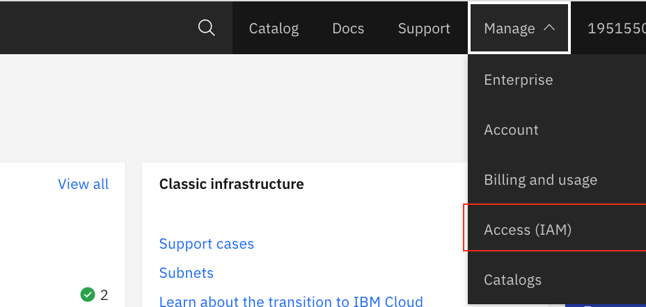

	This should lead you to the main IAM page as illustrated in first figure above.

1. Under the Access Group, you can create a new group of users. This will be an administrator group:

	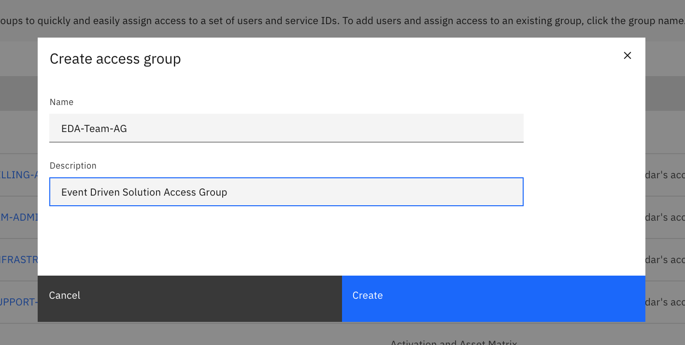

1. Then add users to this newly created group, by selecting users from the list, (those users were invited to join the account at some time) and Click on `Add to group` link.

	

1. Finally, you want now to add _Access Policies_ to control access to Event Streams clusters. For that click _Assign access_ button:

	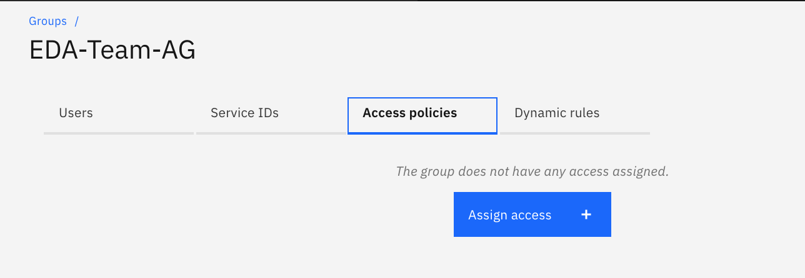

1. Then select the type of resource (Event Streams), you want to define the access policy on:

	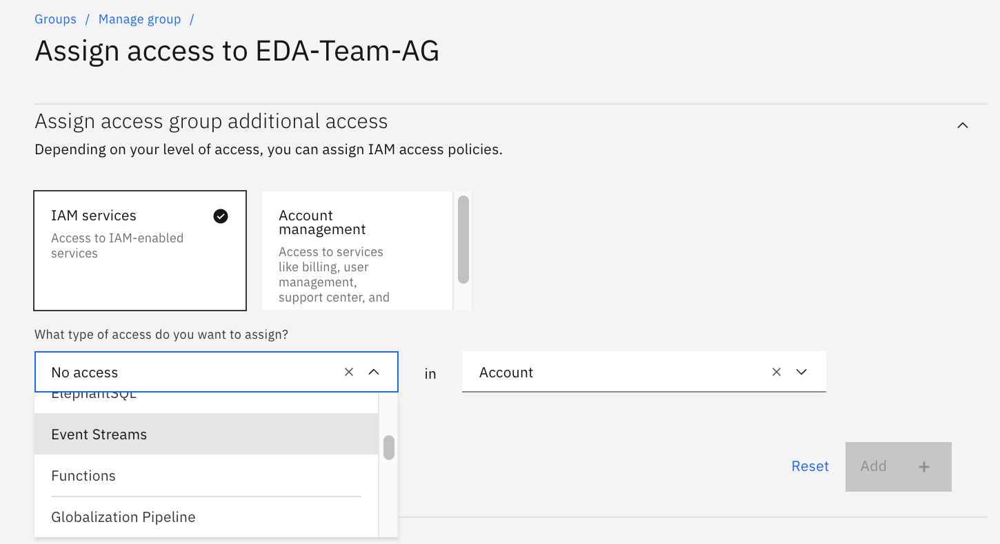

1. Then specify that the group can manage all instances of Event Streams service. The condition applies to the service instance with a _Manager_ role:

	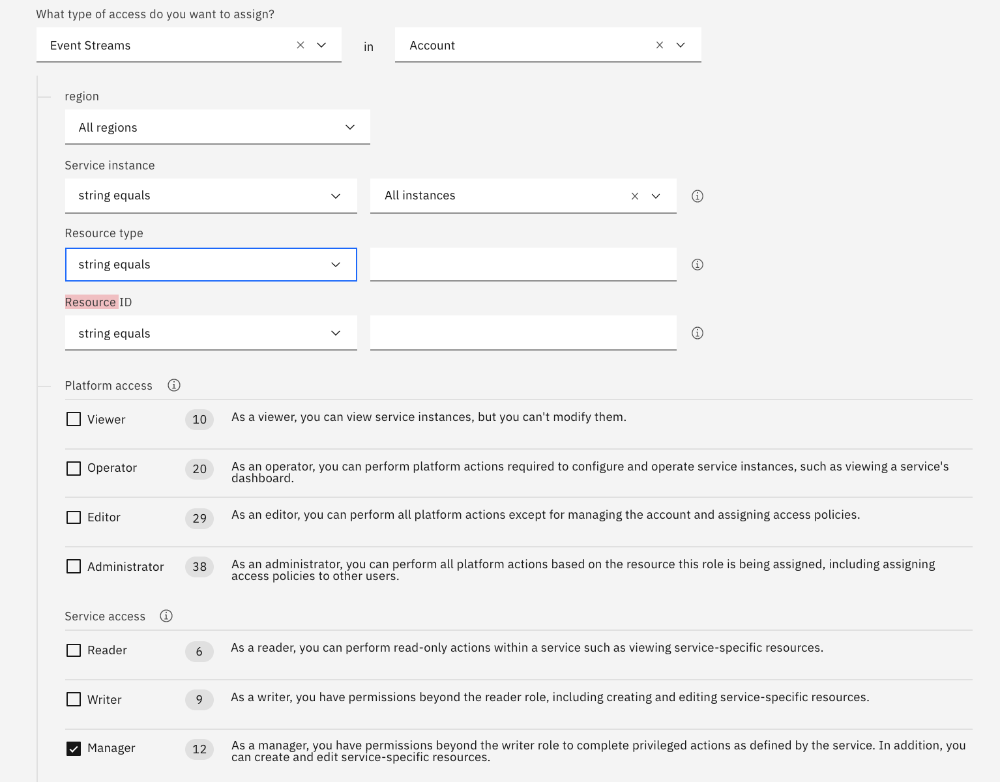

1. Add the policy and assign it to the group. You could stay in the same panel to add more target to the policy.

	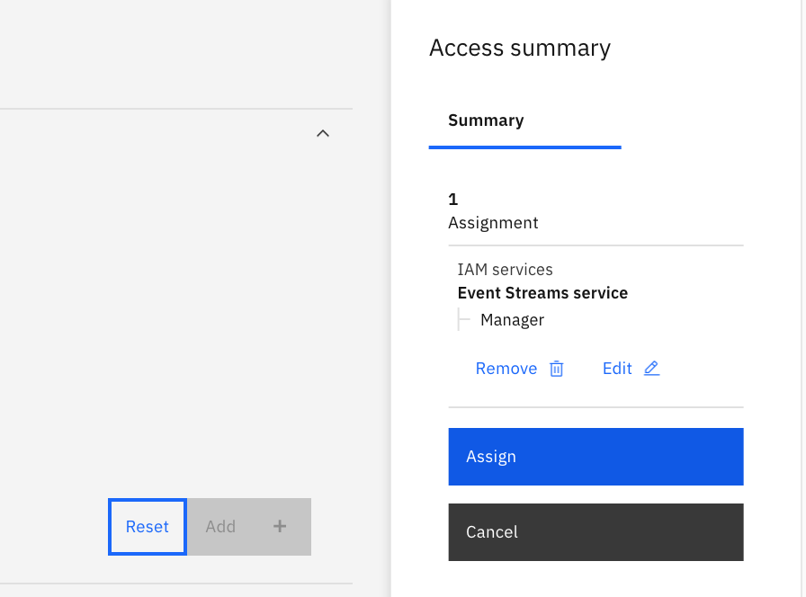

1. The newly created, _access policies for administer / manager_ to any Event Streams services is now listed in the access group:

	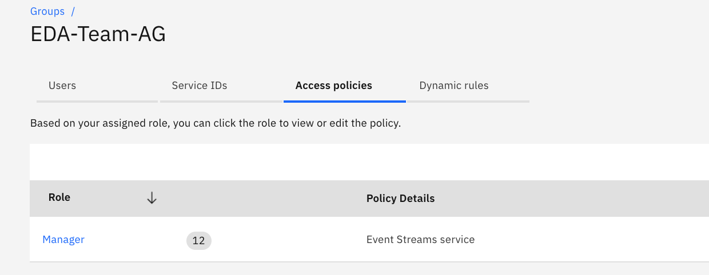

Any user who has a manager role for either 'All' services or 'All' Event Streams services in the same account will also have full access.

## Limiting topic access to group of users

The product document illustrates some access control common scenarios in [this section](https://cloud.ibm.com/docs/services/EventStreams?topic=eventstreams-security#security_scenarios). We recommend reading those settings.

In this step we are implementing one of the classical scenario: suppose we have a line of business that will create topics by applying a naming convention where topic name starts with a prefix like: `bn-lob1-*`.  We want users and service ID to  get read / write access to only those topics matching those prefix.

To do so you need to:

1. Add an access group to include member of the line of business: `bn-lob1-group`
1. Define an access policy with the following criterias:
	* Event streams as resource type
	* All regions
	* Specifying one of the Event Streams resource instance (the one you provisioned [in this lab](/technology/event-streams/es-cloud/))
	* Select the service instance that hosts the target cluster
	* Specify the resource type to be **topic**
	* And the resource ID to matches `bn-lob1-*`

	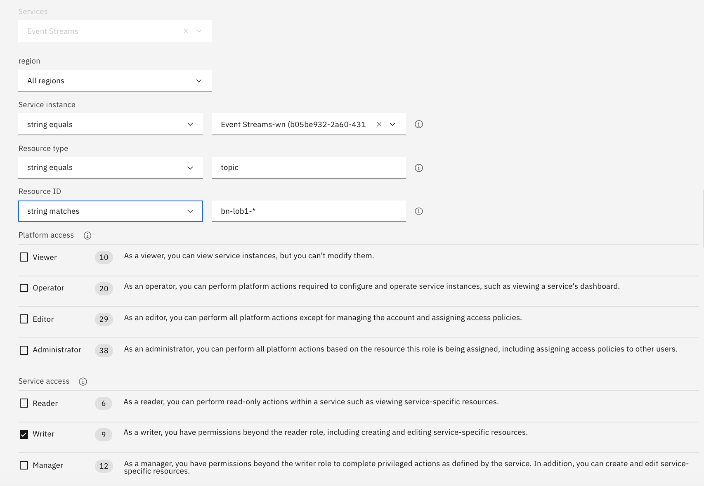

	* Then add a second rule to enforce read access at the cluster level:

	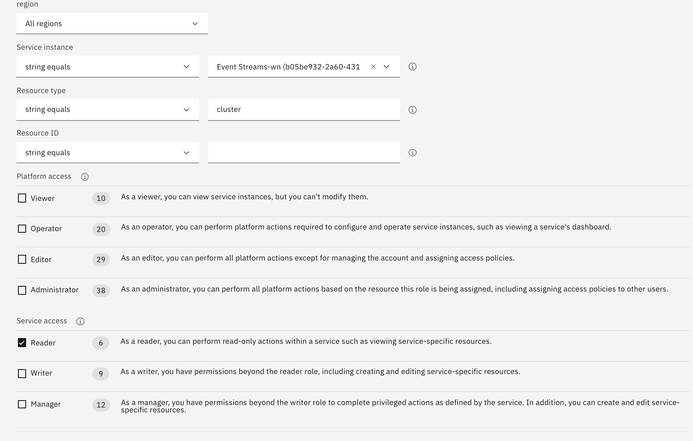

	* Assign the two rules:

	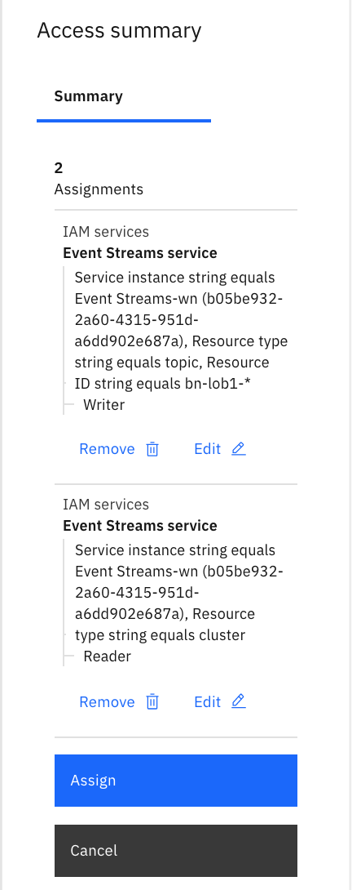

	* The group has the two access policies:

	


## Authentication with API Keys

To let an application to remotely authenticate itself, Event Streams uses API keys.
The goal of this section, is to create API keys so applications, tools, scripts can connect to the newly created IBM Event Streams instance. You will create three keys for the different roles: creation of topics, read access only and read/write access.

1. In your IBM Event Streams instance service page, click on _Service credentials_ on the left hand side menu:

	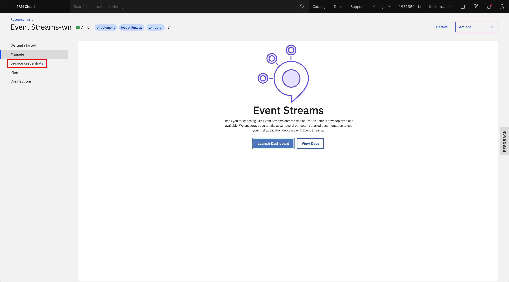

1. Observe, there is no service credentials yet and click on the _New credential_ button on the top right corner:

	

1. Enter a name for your service, choose _Manager_ role for now and click on _Add_:

	

1. You should now see your new service credential and be able to inspect its details if you click on its dropdown arrow on it left:

	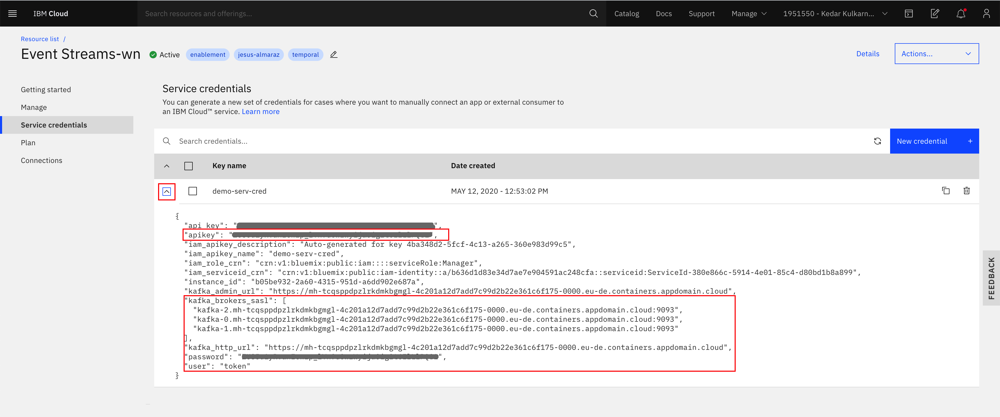

Using the same process you can add a credential for Writer Role. For the Reader role you will use the CLI in the next section.

API Key is used for the `sasl.jaas.config` conncection properties in Kafka consumer or producer:

```properties
security.protocol=SASL_SSL
ssl.protocol=TLSv1.2
ssl.enabled.protocols=TLSv1.2
ssl.endpoint.identification.algorithm=HTTPS
sasl.mechanism=PLAIN
sasl.jaas.config=org.apache.kafka.common.security.plain.PlainLoginModule required username="token" password="am....5";
```

### Adding Keys with CLI

You could create the service credentials using the CLI, so you will add _Reader_ role API Keys:

1. First you can explore the service credentials created previously, using the CLI with `$ ibmcloud resource service-key <service_credentials_name>`:

	```shell
	$ ibmcloud resource service-key demo-serv-cred
	Retrieving service key demo-serv-cred in all resource groups under account bill's Account as A......

	Name:          demo-serv-cred
	ID:            crn:v1:bluemix:public:messagehub:eu-de:a/b636d1d8.....8cfa:b05be932-2....02e687a:resource-key:4ba348d2-...-360e983d99c5
	Created At:    Tue May 12 10:53:02 UTC 2020
	State:         active
	Credentials:
				api_key:                  *****
				apikey:                   *****
				iam_apikey_description:   Auto-generated for key 4ba348d2-5fcf-4c13-a265-360e983d99c5
				iam_apikey_name:          demo-serv-cred
				iam_role_crn:             crn:v1:bluemix:public:iam::::serviceRole:Manager
				iam_serviceid_crn:        crn:v1:bluemix:public:iam-identity::a/b636d1d83e34d7ae7e904591ac248cfa::serviceid:ServiceId-380e866c-5914-4e01-85c4-d80bd1b8a899
				instance_id:              b05be932-2a60-4315-951d-a6dd902e687a
				kafka_admin_url:          https://mh-tcqsppdpzlrkdmkbgmgl-4c201a12d7add7c99d2b22e361c6f175-0000.eu-de.containers.appdomain.cloud
				kafka_brokers_sasl:       [kafka-2.mh-tcqsppdpzlrkdmkbgmgl-4c201a12d7add7c99d2b22e361c6f175-0000.eu-de.containers.appdomain.cloud:9093 kafka-0.mh-tcqsppdpzlrkdmkbgmgl-4c201a12d7add7c99d2b22e361c6f175-0000.eu-de.containers.appdomain.cloud:9093 kafka-1.mh-tcqsppdpzlrkdmkbgmgl-4c201a12d7add7c99d2b22e361c6f175-0000.eu-de.containers.appdomain.cloud:9093]
				kafka_http_url:           https://mh-tcqsppdpzlrkdmkbgmgl-4c201a12d7add7c99d2b22e361c6f175-0000.eu-de.containers.appdomain.cloud
				password:                 *****
				user:                     token
	```

1. Add a `Reader` role API key:

	```shell
	# Get the name of the event streams service:
	ibmcloud resource service-instances
	ibmcloud resource service-key-create bn-lob1-app-reader Reader --instance-name "Event Streams-wn"

	OK
	Service key crn:v1:bluemix:public:messagehub:eu-de:a/b6...248cfa:b05...e687a:resource-key:7ee00.....15a2 was created.

	Name:          bn-lob1-reader
	ID:            crn:v1:bluemix:public:messagehub:eu-de:a/b636d..fa:b05b..7a:resource-key:7ee0042.....b15a2
	Created At:    Wed May 13 00:33:49 UTC 2020
	State:         active
	Credentials:
				api_key:                  xrvMI4PQYmdOcUwPRUJXy6Xlo9UCY9xywNUPiU3jjpKH
				apikey:                   xrvMI4PQYmdOcUwPRUJXy6Xlo9UCY9xywNUPiU3jjpKH
				iam_apikey_description:   Auto-generated for key 7ee0042f-572b-46f6-b9cc-912cc63b15a2
				iam_apikey_name:          bn-lob1-reader
				iam_role_crn:             crn:v1:bluemix:public:iam::::serviceRole:Reader
				iam_serviceid_crn:        crn:v1:bluemix:public:iam-identity::a/b636d1....48cfa::serviceid:ServiceId-b4d3....18af1
				instance_id:              b05....687a
				kafka_admin_url:          https://mh-tcqsppdpzlrkdmkbgmgl-4c201a...1c6f175-0000.eu-de.containers.appdomain.cloud
				kafka_brokers_sasl:       [kafka-0.mh-tcqsppdpzlrkdmkbgmgl-4c2...175-0000.eu-de.containers.appdomain.cloud:9093....]
				kafka_http_url:           https://mh-tcqsppdpzlrkdmkbgmgl-4c20...-0000.eu-de.containers.appdomain.cloud
				password:                 xr......KH
				user:                     token
	```

## Control application access

The last step of this lab is to add a specific IAM group for applications so you can link any future applications to a group so that producer and consumer codes using the Writer role API key as defined previously
can read and write to specific topic as defined by an access policy.

We want to give this Writer role API key to the `bn-lob1-app` group, so applications within this group can create topics and R/W on those topics with the name `bn-lob1-*`.
To do so, we have to add to the Access Group `bn-lob1-app`, the service ID that maps the Key created above:

1. In IAM Access groups select the service IDs tab and click on add service id button:

	

1. Search for the service ID name: `bn-lob1-writer` and

	

1. You should get this result:

	

### Kafka Streams specifics

A lot of Kafka implementations use Kafka Streams API, in this case the applications need to have `Manager` role on topic resource,
and Reader role for cluster and group with a Manager API Key.

### Connecting application using API Key

To connect to Event Streams on cloud, we need to define consumer and producer common configuration as presented in the [product documentation](https://cloud.ibm.com/docs/EventStreams?topic=EventStreams-kafka_using#kafka_api_client)

Here is an exemple of using reactive messaging in microprofile with the liberty kafka connector:

```properties
mp.messaging.connector.liberty-kafka.security.protocol=SASL_SSL
mp.messaging.connector.liberty-kafka.ssl.protocol=TLSv1.2
mp.messaging.connector.liberty-kafka.sasl.mechanism=PLAIN
mp.messaging.connector.liberty-kafka.sasl.jaas.config="org.apache.kafka.common.security.plain.PlainLoginModule required username=token password=longapikeycomingfromservicecredential;"
```

These properties could in fact be part of a secret in Kubernetes and used by the pod.

## Encryption at rest

Event Streams stores message data at rest and message logs on encrypted disks. Event Streams supports customer-managed encryption with provided key: bring you own key. This feature is available on the Enterprise plan only. The [product documentation](https://cloud.ibm.com/docs/EventStreams?topic=EventStreams-managing_encryption
) addresses in detail this capability.

In this section, we just want to present some step by step to play with Key Protect, defining root key, and get Wrapped Keys to be used for encryption.

### Create a Key Protect instance

In the `Create resource` from the IBM Cloud dashboard page, select a `Key Protect` service, add a name, and select a resource pool:

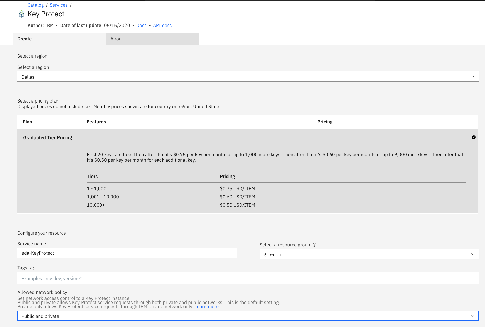

### Create a root key or upload yours

Using the `Manage` menu of Key Protect, and `Add key` button:


Specify to import your own key or create a new one. Give a name

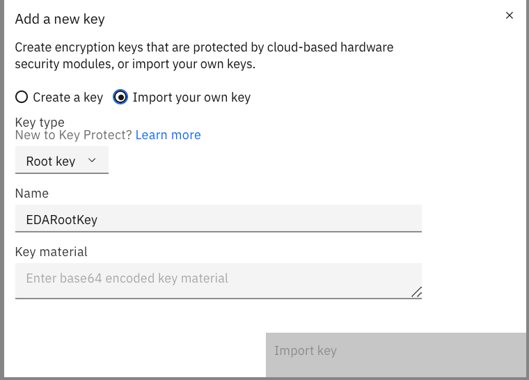

Keys are symmetric 256-bit keys, supported by the AES-CBC-PAD algorithm. For added security, keys are generated by FIPS 140-2 Level 3 certified hardware security modules (HSMs) that are located in secure IBM Cloud data centers


Get the cloud resource name from the newly create key:


### Get a Wrapped Key with API:

```shell
export GUID=$(ibmcloud resource service-instance eda-KeyProtect --id | grep crn | awk '{print $2}’)
export TOKEN=$(ibmcloud iam oauth-tokens | awk '{print $4 }'
)
curl -X POST https://us-south.kms.cloud.ibm.com/api/v2/keys/34f2598f-e6e9-4822-8f51-cd9036e537e8?action=wrap -H 'accept: application/vnd.ibm.kms.key_action+json'    -H 'authorization: Bearer $TOKEN' -H 'bluemix-instance: $GUID'  -H 'content-type: application/vnd.ibm.kms.key_action+json'
```

### Authorize Event Streams to access Key Protect

In IAM application, go to the `Authorizations` menu:


And define event streams as the source service, you can specify a specific instance id or any event streams service. The target is the Key Protect instance. The service access is Reader.

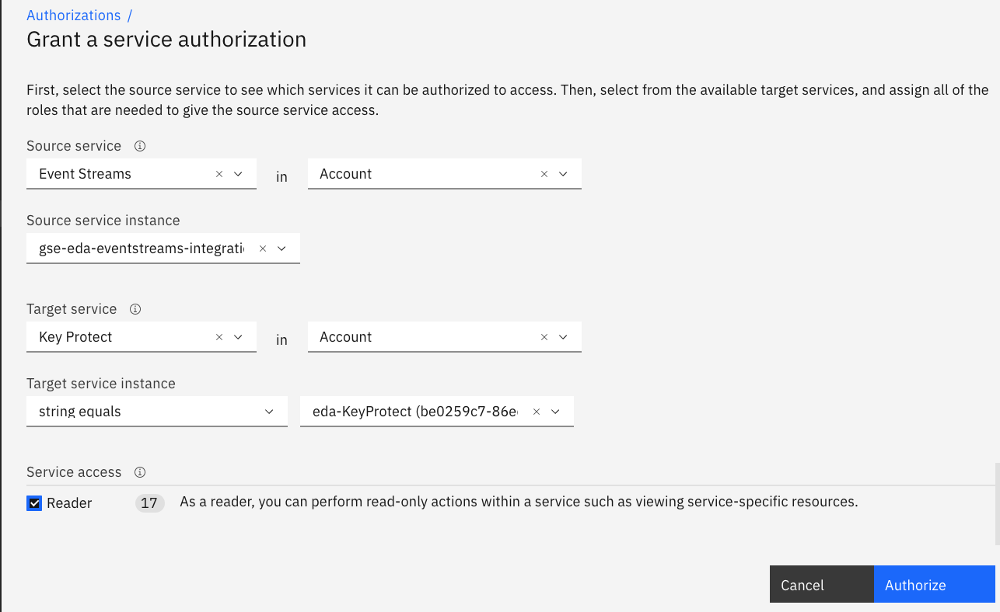

You should get something like:


Now Event Streams could use your wrapped key to encrypte data at rest.


!!! Warning
	Temporarily des-authorizing Event Streams to access Key Protect, will block communication to Event Streams instance.
	Loosing any keys, will mean loosing the data.
	Restoring access by recreating the authorization between ES and Key Protect, will reopen traffic.
	When rotating the root key a new rewrapping of DEK is performed and the new key needs to be communicated to Event Streams.
