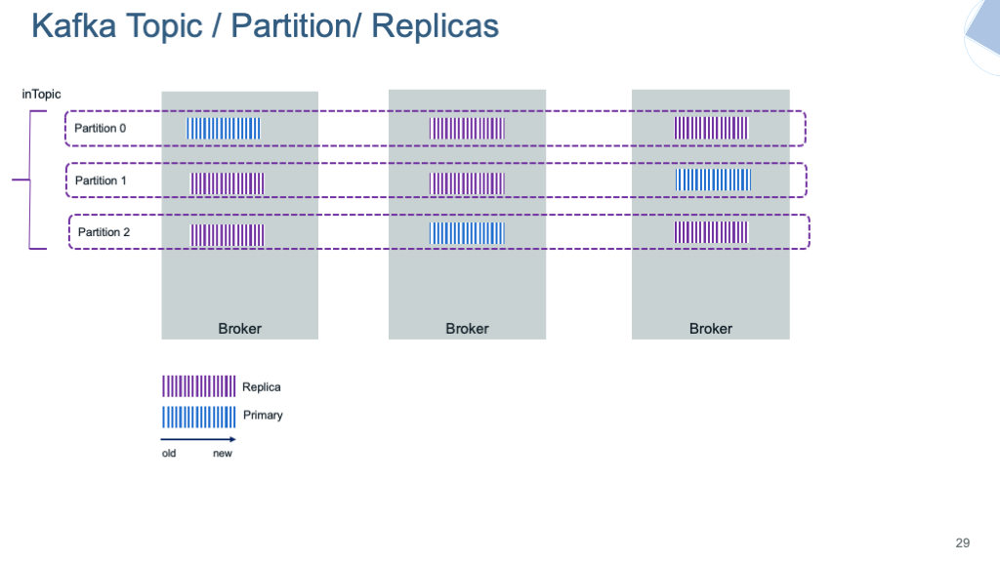
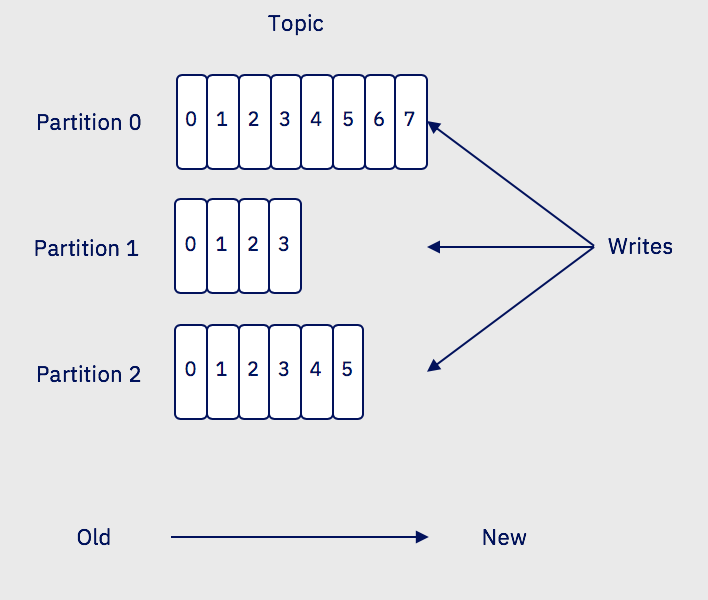
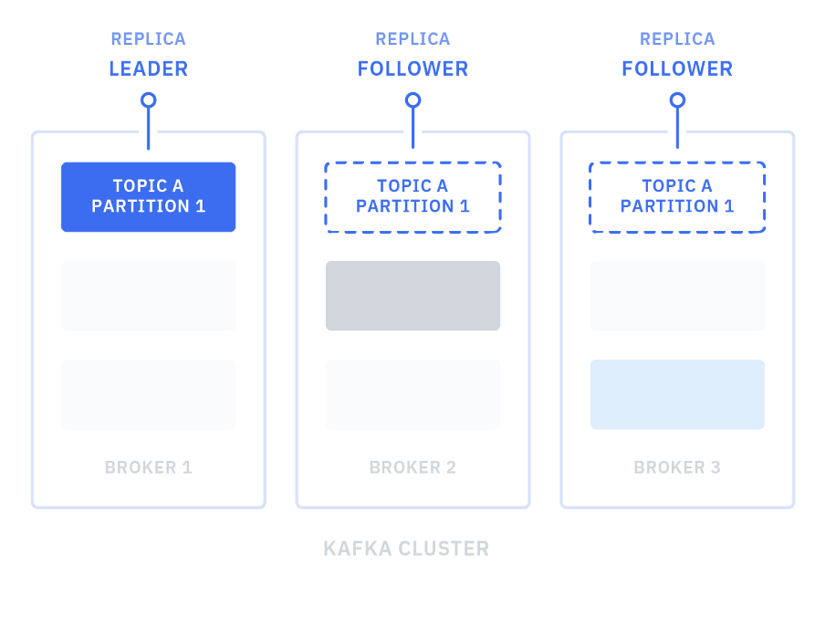

In this article we are summarizing what Apache [**Kafka**](https://Kafka.apache.org) is and grouping some references, notes and tips we gathered working with Kafka while producing the different assets for this Event Driven Architecture references. This content does not replace [the excellent introduction](https://Kafka.apache.org/intro) every developer using Kafka should read.

## Introduction

[Kafka](https://Kafka.apache.org) is a distributed real time event streaming platform with the following key capabilities:

* Publish and subscribe streams of records. Data are stored so consuming applications can pull the information they need, and keep track of what they have seen so far.
* It can handle hundreds of read and write operations per second from many producers and consumers.
* Atomic broadcast, send a record once, every subscriber gets it once.
* Store streams of data records on disk and replicate them within the distributed cluster for fault-tolerance. Persist data for a given time period before delete.
* Can grow elastically and transparently with no downtime.
* Built on top of the ZooKeeper synchronization service to keep topic, partitions and metadata highly available.

<iframe width="560" height="315" src="https://www.youtube.com/embed/aj9CDZm0Glc" frameborder="0" allow="accelerometer; autoplay; encrypted-media; gyroscope; picture-in-picture" allowfullscreen></iframe>

## Kafka Components

The diagram below presents Kafka's key components:

## Brokers

* **Kafka** runs as a cluster of **broker** servers that can, in theory, span multiple data centers. Each brokers manages data replication, topic/partition management, offset management.
To cover multiple data centers within the same cluster, the network latency between data centers needs to be very low, at the 15ms or less, as there is a lot of communication between kafka brokers and between kafka brokers and zookeeper servers.
* The **Kafka** cluster stores streams of records in **topics**. Topic is referenced by producer to send data to, and subscribed by consumers to get data. Data in topic is persisted to file systems for a retention time period (Defined at the topic level). The file system can be network based.

In the figure above, the **Kafka** brokers are allocated on three servers, with data within the topic are replicated two times. In production, it is recommended to use at least five nodes to authorize planned failure and un-planned failure, and when doing replicas, use a replica factor at least equals to three.

## Zookeeper

Zookeeper is used to persist the component and platform states and it runs in cluster to ensure high availability. One zookeeper server is the leader and other are used in backup.

* Kafka does not keep state regarding consumers and producers.
* Depends on kafka version, offsets are maintained in Zookeeper or in **Kafka**: newer versions use an internal Kafka topic called __consumer_offsets. In any case consumers can read next message (or from a specific offset) correctly even during broker server outrages.
* Access Controls are saved in Zookeeper

As of Kafka 2.8+ Zookeeper is becoming optional.

## Topics

Topics represent end points to publish and consume records.

* Each record consists of a key, a value (the data payload as byte array), a timestamp and some metadata.
* Producers publish data records to topic and consumers subscribe to topics. When a record is produced without specifying a partition, a partition will be chosen using a hash of the key. If the record did not provide a timestamp, the producer will stamp the record with its current time (creation time or log append time). Producers hold a pool of buffers to keep records not yet transmitted to the server.
* Kafka store log data in its `log.dir` and topic maps to subdirectories in this log directory.
* **Kafka** uses topics with a pub/sub combined with queue model: it uses the concept of consumer group to divide the processing over a collection of consumer processes, running in parallel, and messages can be broadcasted to multiple groups.
* Consumer performs asynchronous pull to the connected brokers via the subscription to a topic.

The figure below illustrates one topic having multiple partitions, replicated within the broker cluster:

## Partitions

Partitions are basically used to parallelize the event processing when a single server would not be able to process all events, using the broker clustering. So to manage increase in the load of messages, Kafka uses partitions.

* Each broker may have zero or more partitions per topic. When creating topic we specify the number of partition to use.
* Kafka tolerates up to N-1 server failures without losing any messages. N is the replication factor for a given partition.
* Each partition is a time ordered immutable sequence of records, that are persisted for a long time period. It is a log. Topic is a labelled log.
* Consumers see messages in the order they are stored in the log.
* Each partition is replicated across a configurable number of servers for fault tolerance. The number of partition will depend on characteristics like the number of consumers, the traffic pattern, etc... You can have 2000 partitions per broker.
* Each partitioned message has a unique sequence id called **offset** ("abcde, ab, a ..." in the figure above are offsets). Those offset ids are defined when events arrived at the broker level, and are local to the partition. They are immutable.
* When a consumer reads a topic, it actually reads data from all the partitions. As a consumer reads data from a partition, it advances its offset. To read an event the consumer needs to use the topic name, the partition number and the last offset to read from.
* Brokers keep offset information in an hidden topic.
* Partitions guarantee that data with the same keys will be sent to the same consumer and in order.
* Partitions are saved to disk as append log. The older records are deleted after a given time period or if the size of log goes over a limit.
It is possible to compact the log. The log compaction means, the last known value for each message key is kept. Compacted Topics
are used in Streams processing for stateful operator to keep aggregate or grouping by key. You can read more about [log compaction from the kafka doc](https://kafka.apache.org/documentation/#design_compactionbasics).

## Replication

Each partition can be replicated across a number of servers. The replication factor is captured by the number of brokers to be used for replication. To ensure high availability it should be set to at least a value of three.
Partitions have one leader and zero or more followers.

The leader manages all the read and write requests for the partition. The followers replicate the leader content. We are addressing data replication in the high availability section below.

## Consumer group

This is the way to group consumers so the processing of event is parallelized. 
The number of consumers in a group is the same as the number of partition defined in a topic. 
We are detailing consumer group implementation in [this note](/technology/kafka-consumers/#consumer-group)

